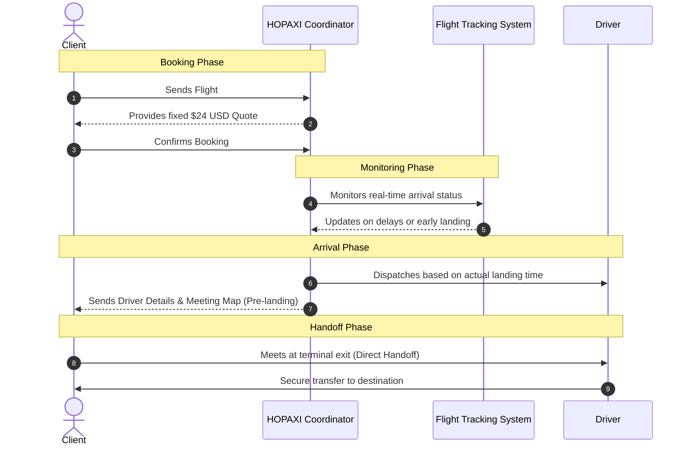
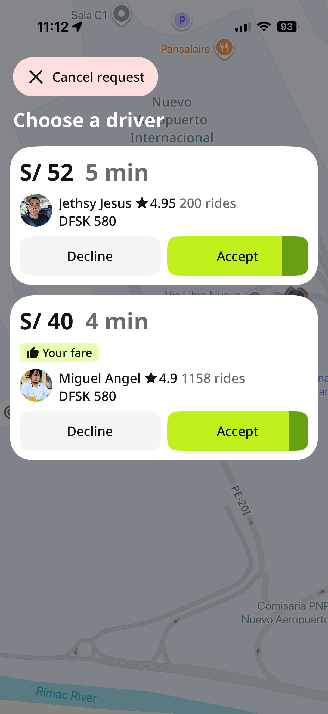
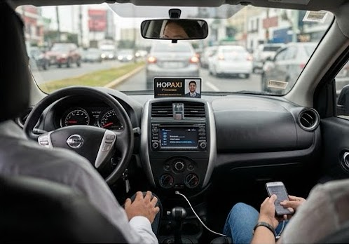

#  HOPAXI | Secure Lima Airport Transfer

HOPAXI is a premium, executive-grade airport transfer service operating at Jorge Chávez International Airport (LIM) in Lima, Peru. We specialize in providing a "certainty-first" experience for international business and leisure travelers, solving the common pain points of arrival stress, language barriers, and fare uncertainty.

  

## 🎯 Project Objective

The primary objective of the HOPAXI web platform is to facilitate secure, high-trust bookings through a streamlined WhatsApp-first workflow. We aim to:
- **Ensure Safety:** Provide verified professional drivers and real-time trip monitoring.
- **Eliminate Uncertainty:** Offer fixed $24 USD fares to core districts (Miraflores, San Isidro, Barranco) with no hidden fees.
- **Bilingual Delivery:** Offer 24/7 coordination in English, Spanish, and Chinese.
- **AI-Readiness:** Maintain machine-readable data structures (`llms.txt`, JSON-LD) to serve travelers using AI agents and modern search interfaces.

## 🔄 Client Service Flow

The following diagram illustrates the end-to-end journey of a HOPAXI client, from initial inquiry to destination arrival.

## 📊 Market Analysis & Differentiators

HOPAXI was designed to eliminate the friction found in standard Peruvian transport apps. While other services require constant negotiation and price-jacking, HOPAXI provides operational stability.

### The Problem: Decision Fatigue & Negotiation Stress
Standard apps at Lima Airport often lead to "Fare Below Average" warnings or multiple volatile offers, causing stress for travelers who just landed.

| High Volatility | Constant Negotiation |
| :---: | :---: |
|  |  |

### The Solution: The HOPAXI Standard
We replace the bidding war with a professional executive protocol and a fixed-fare commitment.

  
  

## 🛠 Tech Stack & Architecture

- **Frontend:** Single-page application using Tailwind CSS and native JavaScript.
- **Internationalization:** Custom `i18n.js` engine supporting English (EN), Spanish (ES), and Chinese (ZH).
- **SEO/AI:** 
    - Full Schema.org/JSON-LD integration for `TaxiService` and `Organization`.
    - `llms.txt` and `llms-full.txt` for LLM crawler compatibility.
- **Hosting:** Firebase Hosting with global rewrites.
- **Communication:** Integrated WhatsApp, SMS, and Call hooks for instant coordinator access.

## 📍 Service Areas

- **Miraflores:** $24 Flat Fare
- **San Isidro:** $24 Flat Fare
- **Barranco:** $24 Flat Fare
- **Historic Center:** Custom Quote

---
*© 2026 HOPAXI Technologies. All rights reserved.*
